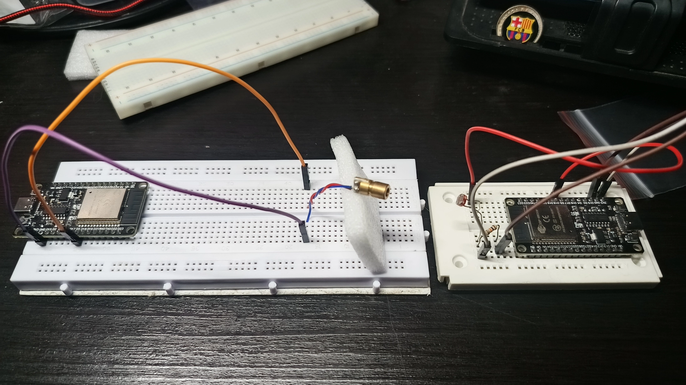
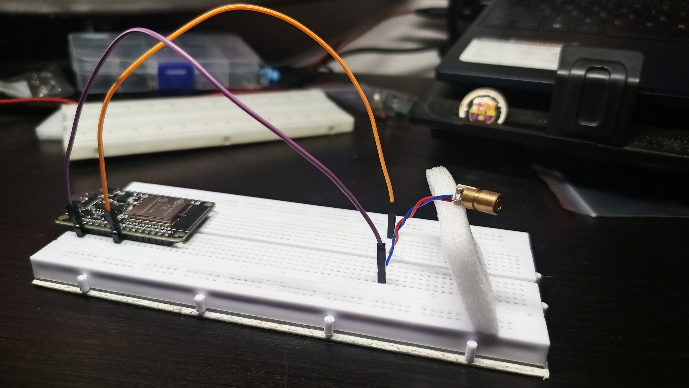
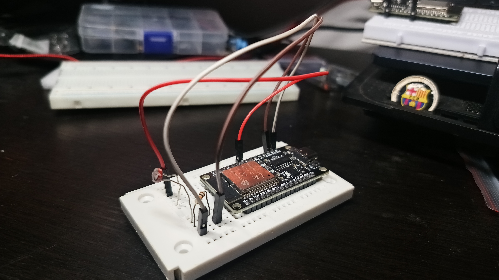

# Transmisión y Recepción de Código Morse utilizando ESP32

Este proyecto implementa un sistema de comunicación utilizando código Morse, donde un láser, controlado por un microcontrolador ESP32, transmite información a través de pulsos de luz. Un fotoresistor (LDR) detecta los pulsos de luz en el receptor, y otro ESP32 decodifica las señales recibidas para reconstruir el mensaje original.

## Componentes Utilizados

- **Microcontrolador ESP32**: Controla el diodo láser y el fotoresistor.
- **Diodo láser**: Utilizado para transmitir los pulsos de luz que representan los puntos y rayas del código Morse.
- **Fotoresistor (LDR)**: Detecta los pulsos de luz provenientes del láser y convierte las señales ópticas en señales eléctricas.
- **Resistor de 10kΩ**: Utilizado para el sensor LDR en el receptor.
- **Cables jumper macho-macho**: Para conectar los componentes.

## Vista Previa

# Transmisor

El transmisor consta de un **diodo láser** controlado por un ESP32. El diodo está conectado al **pin GPIO5** del ESP32 para encenderse y apagarse según el código Morse que se desea transmitir.

**Esquema**:

- Diodo láser: Terminal positiva al pin GPIO5, terminal negativa a GND.

# Receptor

El receptor utiliza un **fotoresistor (LDR)** para detectar los pulsos de luz del láser. La señal del LDR se conecta a un **pin analógico** (GPIO34) del ESP32 para leer la intensidad de luz y convertirla en señales de puntos y rayas.

**Esquema**:

- LDR: Un terminal a 3.3V, el otro a una resistencia de 10kΩ, y el otro extremo de la resistencia a GND. El punto de unión entre el LDR y la resistencia se conecta al pin GPIO34.

## Código

El proyecto está implementado utilizando la plataforma Arduino IDE para programar ambos ESP32. El código de cada parte del sistema (transmisor y receptor) se encuentra en los archivos correspondientes.

### Archivos de código:

- `Transmisor.ino`: Código para el ESP32 transmisor.
- `Receptor.ino`: Código para el ESP32 receptor.
